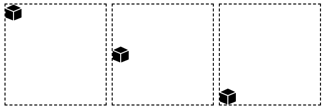
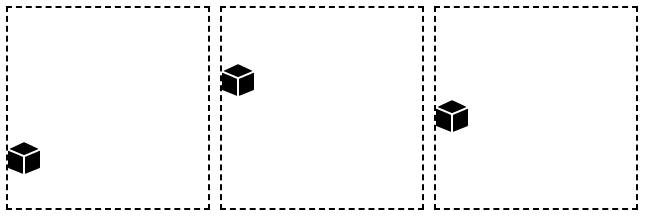

## Syntax

**Note:** This property will be overridden if `background` or `background-position` properties are applied after it.

```css
background-position-y: <value>; 
background-position-y: <direction> <value>;

```

where `<value>` can be one of the following:

- Keywords values
  - `top`: aligns top edge of the background image with the top edge of the container
  - `center`: aligns center of the background image with the center of the container
  - `bottom`: aligns the bottom of the background image with the bottom edge of the container
- Percentage values:
  - `0%`: top edge of the background image is aligned with top edge of the container
  - `50%%`: centers the background image inside a container
  - `100%`: bottom edge of the background image is aligned with bottom edge of the container
- Length values
  - `10px` `5cm` `2rem` `2em`: top edge of the background image is moved from top of the container

and `<direction>` can be one of the following
  - `top`: move from top, default direction
  - `bottom`: move from  bottom


## Example 1

Set `background-position-y` using keywords:

```css
.img {
  border: 2px dashed black;
  width: 200px;
  height: 200px;
  background-image: url("./assets/box.png");
  background-repeat: no-repeat;
}

.img.top {
    background-position-y: top;
}

.img.center {
    background-position-y: center;
}

.img.bottom {
    background-position-y: bottom;
}

```

The resulting output of the code block above is:

 

## Example 2

Set `background-position-y` using percentages:

```css
.img {
  border: 2px dashed black;
  width: 200px;
  height: 200px;
  background-image: url("./assets/box.png");
  background-repeat: no-repeat;
}

.img.top {
    background-position-y: 0%;
}

.img.center {
    background-position-y: 50%;
}

.img.bottom {
    background-position-y: 100%;
}
```

The resulting output of the code block above is:

 

## Example 3

Set `background-position-y` using multiple values:

```css
.img {
  border: 2px dashed black;
  width: 200px;
  height: 200px;
  background-image: url("./assets/box.png");
  background-repeat: no-repeat;
}

.img.top {
    background-position-y: bottom 20%;
}

.img.center {
    background-position-y: bottom 7rem;
}

.img.bottom {
    background-position-y: bottom 2cm;
}
```

The resulting output of the code block above is:

 

