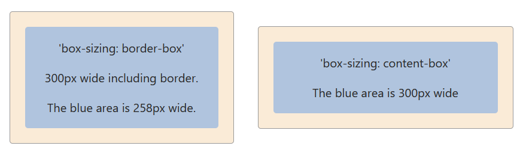

The `box-sizing` property defines how the **width and height of an element are calculated**, determining whether padding and borders are included in the element’s total size.

This property is essential for building predictable and responsive layouts.

---

## Syntax

```css
box-sizing: value;
```

## Values

The box-sizing property accepts the following values:

## border-box

Includes padding and border within the specified width and height of an element.
This ensures the element’s total size remains fixed and predictable.

## Example:

If an element has width: 100px and padding: 30px, the total width remains 100px.

## content-box (default)

Width and height apply only to the content. Padding and border are added outside the defined size.

## Example:

If an element has width: 100px and padding: 50px, the total width becomes 150px.

## Example 1

Setting a div element’s box-sizing to border-box:

.div {
box-sizing: border-box;
}

## Example 2

Setting a div element’s box-sizing to content-box:

.div {
box-sizing: content-box;
}

## Visual Illustration



## In the illustration:

-Both container elements have a width of 300px, a 1px border, and 20px padding.

-Each container holds a child div with width: 100%.

## Results:

-border-box:
The total width of the container (content + padding + border) remains 300px.

-content-box:
The content alone is 300px, resulting in a total width of 342px after adding padding and borders.

## Best Practice

Most modern projects apply border-box globally for consistent sizing:

_,
_::before,
\*::after {
box-sizing: border-box;
}

This approach simplifies layout calculations and helps prevent unexpected overflow issues.

## Summary

The box-sizing property controls how an element’s size is calculated in the CSS box model.
While content-box is the default behavior, border-box is widely preferred for modern layouts because it provides better control, predictability, and maintainability.
