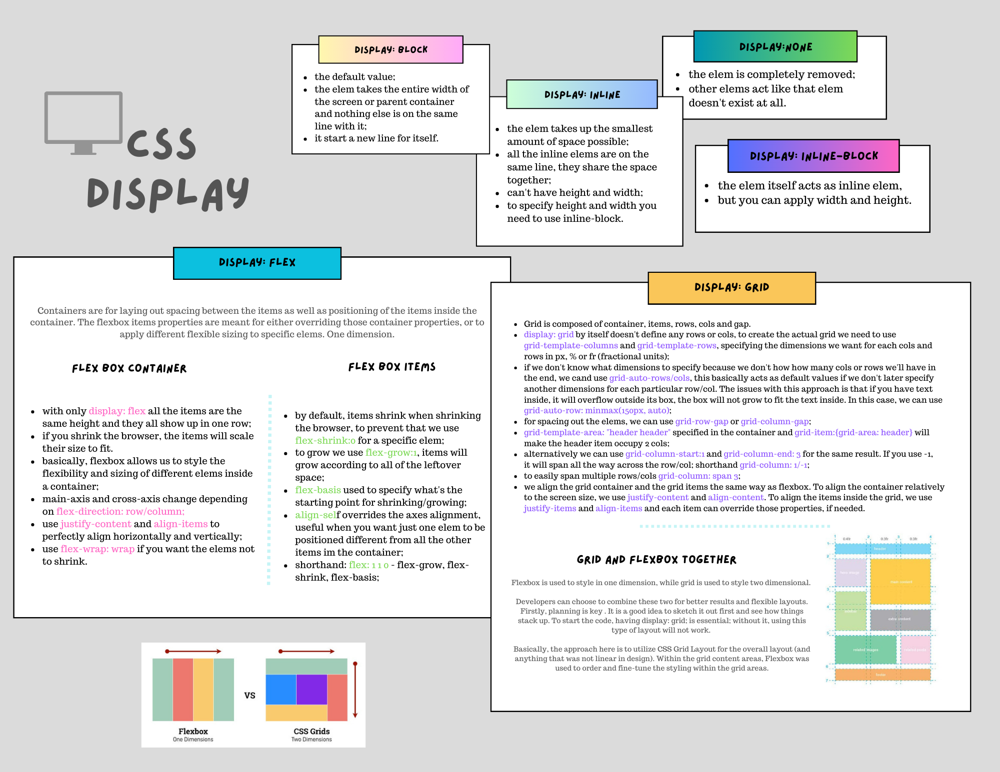

# CSS Display Property

The CSS `display` property is a fundamental attribute that controls how an HTML element is rendered on a webpage. It determines the type of box used for an element and influences its layout and positioning within the document.

Understanding the different values of the `display` property is crucial for building well-structured and responsive web layouts. By choosing the appropriate value, you can control the flow of elements, create grids, and adjust the visibility of specific elements.

In this guide, we will explore the commonly used values of the `display` property, provide examples of their usage, and discuss various considerations and techniques to maximize its potential.


## Syntax

```css
display: <value>;
```

The following values can be appplied to the `display` property:

- `inline`
- `block`
- `contents`
- `flex`
- `grid`
- `inline-block`
- `inline-flex`
- `inline-grid`
- `list-item`
- `run-in`
- `table`
- `table-caption`
- `table-column-group`
- `table-header-group`
- `table-footer-group`
- `table-row-group`
- `table-cell`
- `table-column`
- `table-row`
- `none`
- `initial`
- `inherit`

## Differences between display values:
```css
.block-element {
  display: block;
}

.inline-element {
  display: inline;
}

.inline-block-element {
  display: inline-block;
}

.hidden-element {
  display: none;
}

.flex-container {
  display: flex;
}


```

## Common use cases:

```css
/* Block-level element for creating a layout with stacked elements */
.block-element {
  display: block;
}

/* Inline element for inline text elements */
.inline-element {
  display: inline;
}

/* Inline block for inline elements that need block-level properties */
.inline-block-element {
  display: inline-block;
}

/* Hide an element from the layout */
.hidden-element {
  display: none;
}

/* Flexible container for creating responsive and flexible layouts */
.flex-container {
  display: flex;
}

```

## Overriding display values:


CSS specificity allows you to override default display values of elements. Here's an example of overriding display:
```css
/* Original CSS */
.element {
  display: inline;
}

/* Overriding with higher specificity */
.container .element {
  display: block;
}

```


## Responsive design considerations:
The display property can be combined with media queries to create responsive designs. Here's an example:

```css
@media (max-width: 768px) {
  .element {
    display: none; /* Hide element on smaller screens */
  }
}

@media (min-width: 768px) {
  .element {
    display: block; /* Display element on larger screens */
  }
}


```

## display: grid and display: flex comparison:
CSS Grid and Flexbox are powerful layout tools. Here's an example comparing the two:

```css
.grid-container {
  display: grid;
  grid-template-columns: 1fr 1fr;
  grid-gap: 10px;
}

.flex-container {
  display: flex;
  justify-content: space-between;
}


```


---

## Example 1

Setting a `div` element to behave like a flex box.

```html
<div class="flexdiv">
  <p>First item</p>
  <p>Second item</p>
</div>
```

```css
.flexdiv {
  display: flex;
}
```
---
## CSS Display property cheat sheet: 



