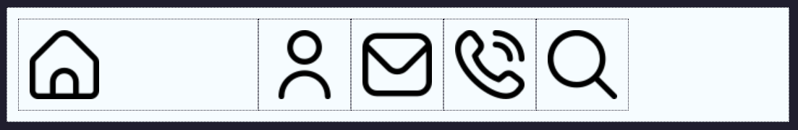

A property that defines the default size of a flex item.

## Syntax

```css
#item-a {
  display: flex;
  flex-basis: <flex-value>;
}
```

The `<flex-value>` can be any of the following:

- Grid keyword ( some are not well supported ) : `auto`, `max-content`, `min-content`
- Pixel value: `300px`
- Percent value: `25%`

## Example 1

An image that has a starting width of 200 pixels:

```css
#img-gallery {
  display: flex;
  flex-flow: row wrap;
}

#img-one {
  display: flex;
  flex-basis: 200px;
}
```
<!-- Beginning of Issue -->
<!-- Add a output image for the example already given in the entry. -->
The output of the above codeblock is shown below:


