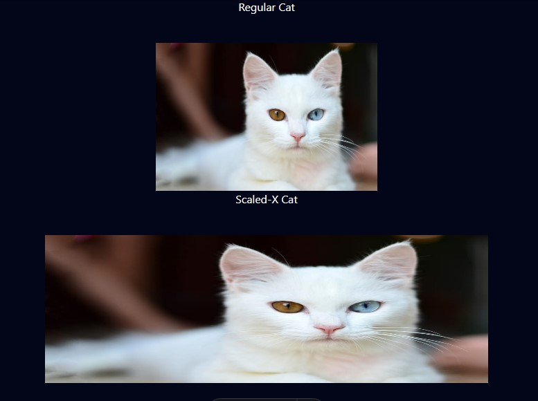

The **`scaleX()`** function in CSS is used to apply a scaling transformation to an element along the X-axis. This means that the element will be stretched or compressed horizontally.

## Syntax

```pseudo
transform: scaleX(s);
```

### Parameters

- `s`: A number that specifies the scaling factor. A value of `1` means no scaling, values greater than `1` enlarge the element, values between `0` and `1` reduce its size, and negative values flip the element horizontally.

## Example

```css
.regularSizeCat {
  transform: scaleX(1);
}


.bigCat {
  transform: scaleX(2);
}
```

```html
<html>
  <head> </head>
  <body style="background-color: #020617;">
    <p>Regular Cat</p>

    

    <p>Scaled-X Cat</p>

    
</html>
```

In this example, the element with the class `bigCat` will be scaled to twice its original **width**.

<!--  -->

