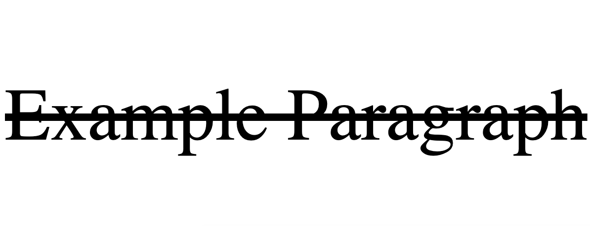

The **text-decoration** CSS property allows you to add a line underneath the text, over the text or through the text. There is also the option to set this property to `none` should it need to be reset. 

The line can also be styled to be wavy, dotted or have a customer colour. 

## Syntax

```css
text-decoration: <text-align-value>;
```

The `text-decoration-value` can be the following:

- `none`
- `underline`
- `overline`
- `line-through`

## Example 1

Paragraph with an underline. 

```css
p {
  text-decoration: underline;
}
```

```HTML
<p>Example Paragraph</p>
```


## Example 2

Paragraph with an overline. 

```css
p {
  text-decoration: overline;
}
```

```HTML
<p>Example Paragraph</p>
```


## Example 3

Paragraph with a line through. 

```css
p {
  text-decoration: line-through;
}
```
```HTML
<p>Example Paragraph</p>
```



## Example 4

Paragraph with a wavy red underline. 

```css
p {
  text-decoration: red wavy underline;
}
```
```HTML
<p>Example Paragraph</p>
```

