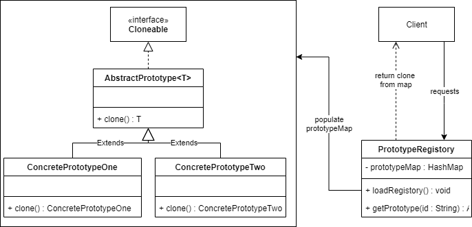

The _prototype pattern_ adds cloning functionality to an object's class. After the instantiation an initial object, the prototype removes the 
need for the 'new' keyword in creating subsequent objects at run time. New objects are created using the property values of a pre-existing object.

There are two types of copying associated with the prototype pattern. They are:
- Shallow Copy (copies the immediate property values)
- Deep Copy (copies the immediate values, plus any referenced object)

## Example: Shallow Copy Vs Deep Copy
To illustrate the difference between the shallow and deep copy, a model has been provided below, consisting of two classes TvSeries and Episode. 
Cloning functionality has been added to TvSeries by implementing the Cloneable interface.

```java
public class TvSeries implements Cloneable
{
    private final String name;
    private final int seriesNo;
    // Notice one or more properties are a complex type and mutable
    private final List<Episode> episodes;

    public TvSeries(String name, int seriesNo, List<Episode> episodes)
    {
        this.name = name;
        this.seriesNo = seriesNo;
        this.episodes = episodes;
    }
    
    // Shallow copy method
    @Override
    public TvSeries clone() throws CloneNotSupportedException {
        // Cast to TvSeries as super returns Object
        return (TvSeries) super.clone();
    }

    // Deep copy
    public TvSeries deepCopy() {
        // New Episode objects are created during the copy
        return new TvSeries(this.name, this.seriesNo, this.episodes.stream()
                                                                 .map(episode -> new Episode(episode.getName(), episode.getEpNo()))
                                                                 .collect(Collectors.toList()));
    }
    
    // Getters and toString
}

```
```java
public class Episode
{
    private String name;
    private int epNo;

    public Episode(String name, int epNo)
    {
        this.name = name;
        this.epNo = epNo;
    }

    // Getters, setters and toString
}
```
Note: The properties of the episode class are mutable. This is to illustrate a potential drawback in the shallow copy method implemented in the 
TvSeries class.
```java
public class Main {
    public static void main(String[] args) throws CloneNotSupportedException
    {
        // A 'new' TvSeries object is created as seriesOne
        Episode episodeOne = new Episode("Hello Friend", 13);
        final Series seriesOne = new Series("Mr Robot", 1, Collections.singletonList(episodeOne));

        // A second TvSeries object is created by shallow copying seriesOne
        final Series seriesTwo = seriesOne.clone();
        // Change the name of S2ep1
        seriesTwo.getEpisodes().get(0).setName("Unmask");
        // S2ep1 name has changed
        System.out.println(seriesTwo.getEpisodes().get(0).getName()); // Unmask
        // But, so has S1ep1 :(
        System.out.println(seriesOne.getEpisodes().get(0).getName()); // Unmask
    }
}
```
The shallow copy only copies the outermost object, and references the same complex object properties in memory. As there is now one object with 
two references to it, changing a value may result in unwanted behaviour. Below is the same example but using the deepCopy() in place of clone().
```java
public class Main {
    public static void main(String[] args) throws CloneNotSupportedException
    {
        // A 'new' TvSeries object is created as seriesOne
        Episode episodeOne = new Episode("Hello Friend", 13);
        final Series seriesOne = new Series("Mr Robot", 1, Collections.singletonList(episodeOne));

        // A second TvSeries object is created using a deep copy of seriesOne
        final Series seriesTwo = seriesOne.deepCopy();
        // Change the name of S2ep1
        seriesTwo.getEpisodes().get(0).setName("Unmask");
        // S2ep1 name has changed
        System.out.println(seriesTwo.getEpisodes().get(0).getName()); // Unmask
        // And s1ep1 name remains correct :)
        System.out.println(seriesOne.getEpisodes().get(0).getName()); // Hello Friend
    }
}
```

## UML Design



## Example: Prototype
User Repo
```java
public class UserRepository {
    // Returns a list of film titles
    public List<String> getUserFilmsHistory() {
        return Arrays.asList("Army of the Dead", "King Arthur: Legend of the Sword", "Total Recall", "Friday the 13th", "The General's Daughter",
                             "American Gangster", "Replicas", "Army of Thieves", "21 Jump Street", "The Harder They Fall");
    }

    // Returns a list of Tv show titles
    public List<String> getUserTvSeriesHistory() {
        return Arrays.asList("Maya and the Three", "The Thundermans", "Riverdale",  "Locke and Key", "Catching Killers", "Cocomelon", "Maid",
                             "Colin in Black and White", "Squid Game", "You");
    }
}
```
Models
```java
public abstract class Show<T> implements Cloneable
{
    // Implements clone in abstract class to make use of generics
    @Override
    public T clone() throws CloneNotSupportedException {
        return (T) super.clone();
    }
}
```

```java
// Film extends Show<Film>, so its clone method will return a Film instance
public class Film extends Show<Film>
{
    private String title;
    private String format;
    private String thumbnailLocation;

    // Getters, setters and toString
}
```

```java
// TvSeries extends Show<TvSeries>, so its clone method will return TvSeries instance
public class TvSeries extends Show<TvSeries>
{
    private String title;
    private String format;
    private String thumbnailLocation;

    // Getters, setters and ToString
}
```
Registory
```java
public class ShowCache
{
    // A HashTable that contains the initial model object from which we clone from
    public static Hashtable<String, Show<?>> showMap = new Hashtable<>();

    // Instanciats the initial objects from which we clone from
    public static void loadCache()
    {
        final TvSeries tvSeries = new TvSeries();
        final Film film = new Film();
        showMap.put("Tv Series", tvSeries);
        showMap.put("Film", film);
    }

    // Returns clone of object stored in showMap to client
    public static Show<?> getShow(String showId) throws CloneNotSupportedException, ShowIdNotRecognisedException
    {
        // Switch statement to find out which clone is needed
        switch (showId)
        {
            case "Film":
                Film cashedFilm = (Film) showMap.get(showId);
                return cashedFilm.clone();
            case "Tv Series":
                TvSeries cashedTvSeries = (TvSeries) showMap.get(showId);
                return cashedTvSeries.clone();
            default:
                throw new ShowIdNotRecognisedException("Unable to get show: " + showId);
        }
    }
}
```

```java
public class ShowIdNotRecognisedException extends Throwable
{
    private static final long serialVersionUID = 1;

    public ShowIdNotRecognisedException(final String message)
    {
        super(message);
    }
}

```
Main
```java
public class Main {

    public static void main(String[] args)
    {
        // Create initial objects
        ShowCache.loadCache();
        final UserRepository userRepository = new UserRepository();
        // For each film title, clone Film object and set appropriate properties. Return list
        final List<Film> filmHistory = userRepository.getUserFilmsHistory().stream().map(entry -> {
            Film film = null;
            try {
                film = (Film) getShow("Film").clone();
                film.setTitle(entry);
                film.setFormat(".mp4");
                film.setThumbnailLocation("films/assets/" + entry.toLowerCase().replace(" ", "_") + film.getFormat());
            } catch (CloneNotSupportedException | ShowIdNotRecognisedException e) {
                e.printStackTrace();
            }
            return film;
        }).collect(Collectors.toList());

        // For each tv show title, clone TvSeries object and set appropriate properties. Return list
        final List<TvSeries> tvSeriesHistory = userRepository.getUserTvSeriesHistory().stream().map(entry -> {
            TvSeries tvSeries = null;
            try {
                tvSeries = (TvSeries) getShow("Tv Series").clone();
                tvSeries.setTitle(entry);
                tvSeries.setFormat(".mp4");
                tvSeries.setThumbnailLocation("tv-shows/assets/" + entry.toLowerCase().replace(" ", "_") + tvSeries.getFormat());
            } catch (CloneNotSupportedException | ShowIdNotRecognisedException e) {
                e.printStackTrace();
            }
            return tvSeries;
        }).collect(Collectors.toList());
        
        // Print filmHistory and tvSeriesHistory to the console
        System.out.println(filmHistory);
        System.out.println(tvSeriesHistory);
    }
}
```


