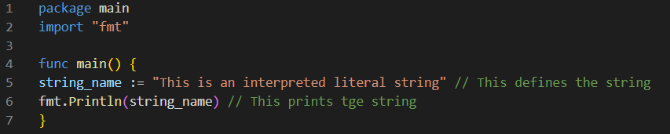
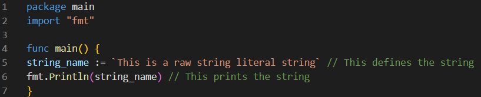
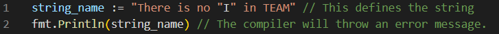
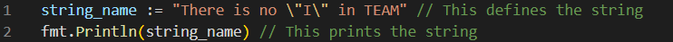

# Strings

A Go **string** is a data type that represents UTF-8 encoded read-only slice of bytes.

As in many other languages, strings in Go are sequences of characters. But even if Go strings share a number of similarities with strings in other languages, they also have some important differences that you should be aware of.

Since each and every character in a Go String is represented by one or more bytes, **they are immutable**: once a Go string is created, its value cannot be changed. If you try to change it, the compiler will throw an error message.

## Go string literals and escapes

### Go string literals

A Go string literal is a sequence of characters enclosed either within double-quotes `""` (also called *interpreted literals*) or backticks ` `` `  (also called *raw string literals*).

There are some differences between using interpreted or raw string literals. The most important ones are that interpreted literals support escape characters but do not span multiple lines, while raw string literals do not support escape characters, cannot contain backticks and can span multiple lines.

Here is an example of how strings are defined and printed in Go using double quotes `""`:


Here is an example of how strings are defined and printed in Go using backticks ``:


### Go string escapes

As it was mentioned previously, escape characters are only supported in interpreted literals (remember: an interpreted literal is a string that uses double quotes `""`).  Here you can see a list of some escape characters supported by Go strings: 

|	Purpose			|	Escape Character	|
|	:---:			 	  	   |		:---:					| 
| Single quote 	| ` \'` 						|
| Double quote   | ` \''` 						| 
| New line 			| ` \n`						| 
| Horizontal tab  | ` \t` 						| 
| Vertical tab		| `\v` 							| 
| Backspace 		| ` \b` 						|  
| Carriage return| ` \r` 						| 
| Backslash 	    | ` \\`  						|

Strings are useful to avoid ambiguities when the string you are creating has a character that may be problematic. An example of this would be if you want to define `There is no "I" in TEAM` as a string. Since the string has double quotes in it, the compiler would send an error message if you try to define it as it is. This can be avoided by using the ``` \''```  escape character. Take a look at this example:



This would be solved if the double quote escape character ``` \''``` is used like this:



If you want to know more about Go strings, we recommend you to read Go101's [Strings in Go](https://go101.org/article/string.html) page.