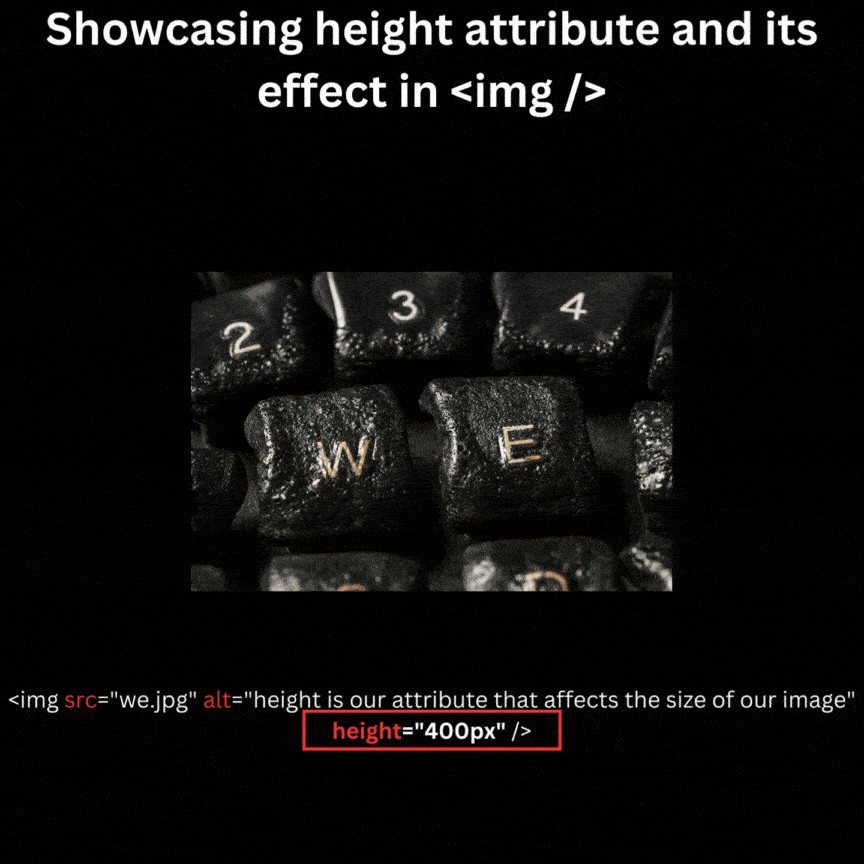



---
Title: 'Attributes'
Description: 'Attributes can be added to the opening tag of an HTML element to change its default behavior or provide additional data about it.'
Subjects:
  - 'Web Development'
  - 'Web Design'
Tags:
  - 'Attributes'
  - 'Elements'
  - 'Tags'
CatalogContent:
  - 'learn-html'
  - 'paths/front-end-engineer-career-path'
---


# HTML Attributes 
HTML attributes are essential elements that can be added to the opening tag of an HTML element. These attributes modify the default behavior of the element or provide additional information about it. 

Attributes consist of a name and need to be set off equal to a value. Values are enclosed in double or single quotation marks. 
## Syntax 
The syntax for adding attributes to an HTML element is as follows: 
 ```html 
 <tagname attribute="value"></tagname> 
 ```
 
## Examples 

 1. **Image Attributes**

Consider an `` element, commonly used to display images. It can have several **attributes**, such as `src`, `width`, and `height`, which significantly influence how the image is presented on a web page. As we have declared its dimentions to our element. Hence we control the deserible output of the illustration inside of our HTML file.
```html

```




 2. ### `href` Attribute (Hyperlink)

The `href` attribute is used in anchor (`<a>`) tags to specify the URL to which a link leads. Here's an example:
```html
<a href="https://www.example.com" >Visit Example</a>
```


3. ###  `disabled` Attribute (Form Elements)

The `disabled` attribute is applied to form elements like buttons and inputs to make them non-interactable:
```html
<button disabled>Submit</button>
```


## Conclusion
These are just a few examples of HTML attributes. HTML provides a wide range of attributes that enhance the functionality and styling of web pages, making it a powerful tool for web development.