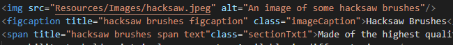

**Title**

**HTML global attribute**

In the browser the ‘title’ attribute displays additional information about the HTML element in the form of a mouse over tooltip.

**Syntax**

The title attribute uses the *name=”value”* pair syntax.

\<start tag **title=”value”**\>elements content\</end of tag\>

For empty elements (without a closing tag):

\<start tag **title=”value”**\>

**Example**

****

**Best Practice**

Best practice suggests that the ‘title’ attribute be written in lower case letters, whilst this is not strictly necessary in HTML, other document types like XHTML demand lowercase.

Further the value of the attribute should be surrounded by double quotation marks. If the value itself contains double quotation marks single quotation marks should be used. Multi word title values will not render correctly if quotation marks are omitted.

**Additional Information**

Attributes can be added to the opening tag of an HTML element to change its default behaviour or provide additional data about it.

For further attribute information: <https://www.codecademy.com/resources/docs/html/attributes>

Interested in helping build Docs? Read the [Contribution Guide](https://github.com/Codecademy/docs/blob/main/.github/CONTRIBUTING.md) or share your thoughts in this [feedback form](https://codecademyready.typeform.com/to/hzVIWDgz).
