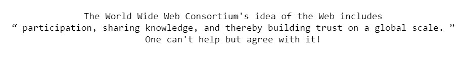

The `<q>` tag is used to represent a brief inline quotation, as opposed to the [`<blockquote>` tag](https://www.codecademy.com/resources/docs/html/tags/blockquote) being used for longer ones.

It accepts a `cite` attribute that links to a valid URL that provides further context for the quotation.

## Syntax

The `<q>` tag requires an opening and closing tag wrapped around a line of text. The browser will automatically enclose the text in quotation marks:

```html
<q cite=""><!-- Brief quotation goes inside the tag --></q>
```

## Example

```html
<!-- The text between the q tags will be surrounded by quotation marks -->
<p>
  The World Wide Web Consortium's idea of the Web includes
  <q cite="https://www.w3.org/Consortium/mission">
    participation, sharing knowledge, and thereby building trust on a global
    scale.
  </q>
  One can't help but agree with it!
</p>
```


