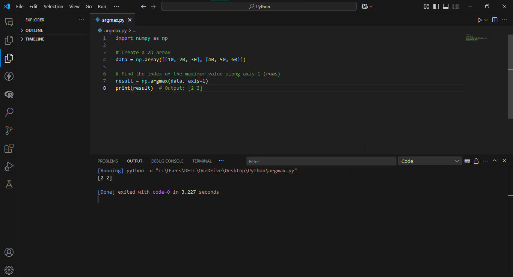

# argmax()

The NumPy `.argmax()` function returns the indices of the maximum values along a specified axis in an array.

## Syntax

```python
numpy.argmax(array, axis=None, out=None, keepdims=<no value>)

import numpy as np

# Create and analyze 1D array
scores = np.array([10, 30, 20, 50, 40])
max_index = np.argmax(scores)
print("Index of max value:", max_index)  # Output: 3
print("Max value:", scores[max_index])   # Output: 50
import numpy as np

# Create 2D array
matrix = np.array([[1, 5, 3], 
                  [4, 2, 6]])

# Analyze columns (axis=0)
print("Max indices per column:", np.argmax(matrix, axis=0))  # Output: [1 0 1]

# Analyze rows (axis=1)
print("Max indices per row:", np.argmax(matrix, axis=1))     # Output: [1 2]

## Codebyte Example
import numpy as np

# Create a 2D array
data = np.array([[10, 20, 30], [40, 50, 60]])

# Find the index of the maximum value along axis 1 (rows)
result = np.argmax(data, axis=1)
print(result)  # Output: [2 2]


