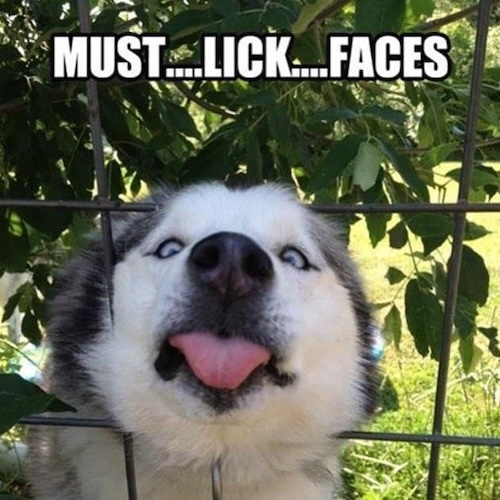

The `".getextrema()"` method in the Pillow library is a simple way to find the minimum and maximum (i.e. darkest and brightest) pixel values in an image. In other words, it tells you the range of pixel values that exist in the image.


### How It Works
- **For single-band images (e.g., grayscale):**  
When you call `.getextrema()` on a grayscale image, it returns a tuple like `(min, max)`, where:

    - `min` is the darkest (lowest) pixel value found.
    - `max` is the brightest (highest) pixel value found.

- **For multi-band images (e.g., RGB or RGBA):**  
When you apply it to a color image, the method returns a tuple of tuples—one for each channel (red, green, blue, and possibly alpha). For example, you might get something like:

```
((min_R, max_R), (min_G, max_G), (min_B, max_B))
```
This tells you the minimum and maximum values for each of the individual color channels.

## Syntax
```
cute_dog_image.getextrema()
```

## Example
Here is the image used:  


The following example demonstrates the usage of the `".getextrema()"` method:
```
from PIL import Image

# Open an image file
cute_dog_image = Image.open("funny_husky.jpg")

# Get extrema for the image
extrema = cute_dog_image.getextrema()

print("Extrema of the image:", extrema)
```

Here is the output:
```
Extrema of the image: ((0, 255), (0, 255), (0, 255))
```

### Why It’s Useful
- **Quick Overview of Pixel Value Range:**  
It helps you quickly determine the overall contrast or brightness spread in an image. For instance, if the extrema of a grayscale image are (10, 245), then the darkest pixel is 10 and the brightest is 245, giving you an idea about the contrast.

- **Preprocessing and Analysis:**  
Knowing the pixel value range can be useful for image processing tasks, such as:
    - Adjusting contrast.
    - Performing thresholding.
    - Identifying saturation issues.
