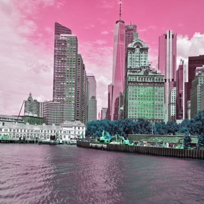

The **`.merge()`** is used to set of single band images into a new multiband image. We can create a new image by merging specific bands when we working with multispectral or multichannel images such as RGB or CMYK images.

## Syntax

```pseudo
Image.merge(mode, bands)
```

- `mode` : The parameter is the mode of the new multiband image.
- `bands` :This parameter is a tuple of the individual image bands that is to be merged. The individual images should be single-channel image or a grayscale image.

## Example

The code below splits the image into single bands and merge them.


```py
from PIL import Image
image1= Image.open('media/Boston.jpg')
image1.load()
im = image1.resize((400,400))

r,g,b = im.split()
new_image= Image.merge('RGB', (b,r,g))
new_image.show()
```

**The output image**

