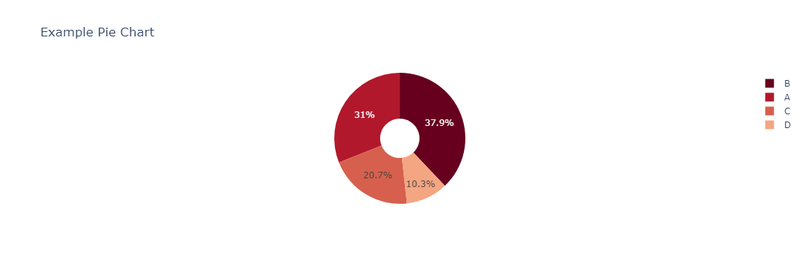

In Python, the **`pie()`** method from the Plotly library is used to create a pie chart, which visually represents data proportions. This method helps transform data into an appealing visual format, making it easier for readers to understand the relationships between variables.

## Syntax

```
plotly.express.pie(values=None, names=None, title=None, hole=None, color_discrete_sequence=None, hover_data=None, labels=None, ...)
```

- `values` - The values that will define the pie slices
- `names` - The labels for each pie slice
- `title` - The title of the chart
- `hole` - Creates a donut chart if value is between 0 and 1
- `color_discrete_sequence` - The color sequence for the pie slices
- `hover_data` - The column name for additional data to show on hover
- `labels` - Custom labels

## Example

The example below shows the usage of the `.pie()` method as follows:

```py
# Import necessary libraries
import plotly.express as px
import pandas as pd

# Define example data
data = {
    'Category': ['A', 'B', 'C', 'D'],
    'Value': [45, 55, 30, 15]
}

# Create a DataFrame
df = pd.DataFrame(data)

# Create and display a pie chart
fig = px.pie(
    df,
    values='Value',
    names='Category',
    title='Example Pie Chart',
    hole=0.3,
    color_discrete_sequence=px.colors.sequential.RdBu,
    labels={'Category': 'Category Name'}
)

# Display the plot
fig.show()
```

The code above generates the following output:


