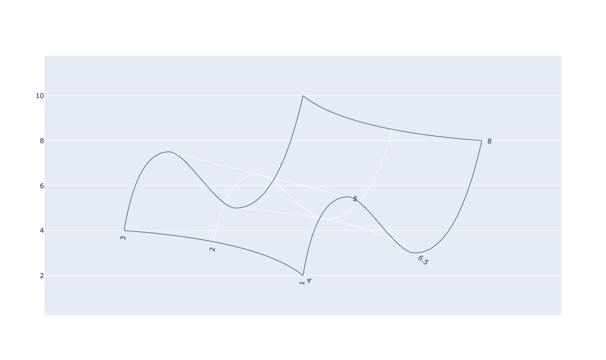

The **`.Carpet()`** , which is referred specifically as "carpet plot", is a Plotly function used to display interaction between one or more independent variables and one or more dependent variable in a two-dimensional plot.

## Syntax

```pseudo
plotly.graph_objects.Carpet(a=None,b=None,x=None, y=None, ...)

```

- `a`: First parameter values as an array
- `b`: Second parameter values as an array.
- `x`: (optional) It is a two dimensional x-coordinates at each carpet point and when omitted, the plot is a cheater plot and x-axis is hidden by default
- `y` : It is a two dimensional y-coordinates at each carpet point.

- The ellipses is an indication of optional paratemeters that can be added.

## Example

```py
from plotly import graph_objects as go


fig = go.Figure(go.Carpet(
    a = [4, 4, 4, 6.5, 6.5, 6.5, 5, 5, 5, 8, 8, 8],
   b = [1, 2, 3, 1, 2, 3, 1, 2, 3, 1, 2, 3],
   y = [2, 3.5, 4, 3, 4.5, 5, 5.5, 6.5, 7.5, 8, 8.5, 10],
))

fig.show()
```

The above code generates the following output:


