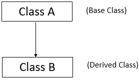
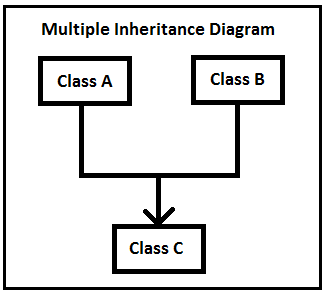
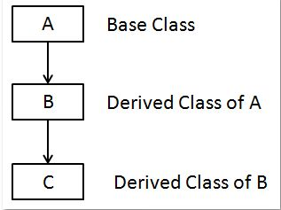
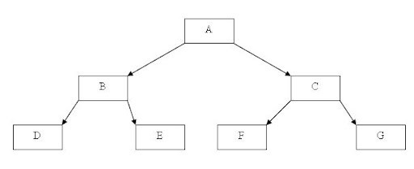
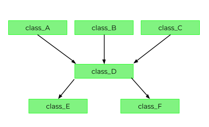
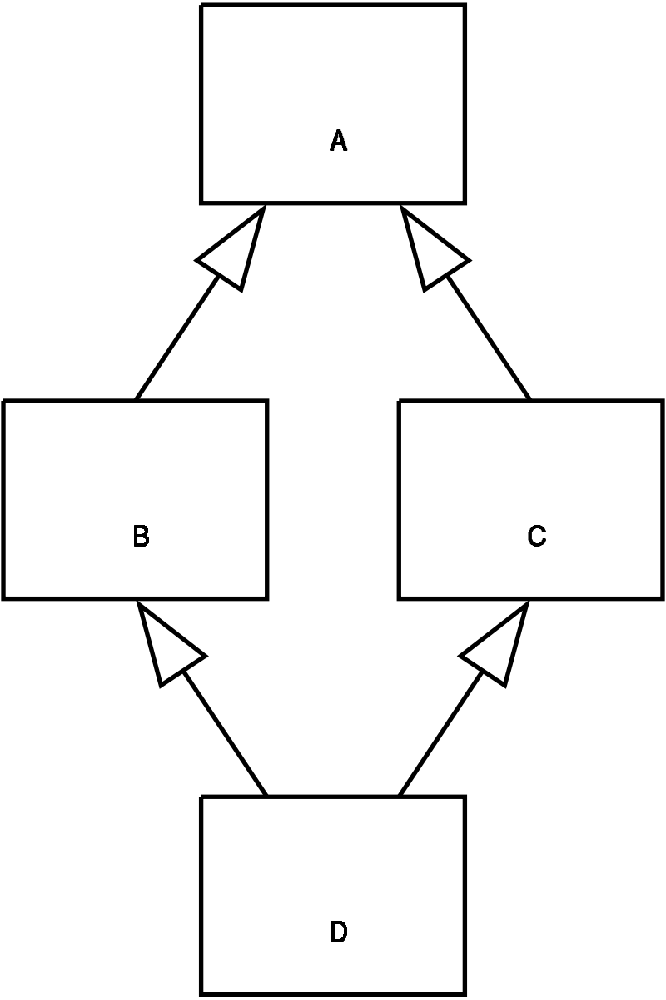

 Inheritance is a concept in object-oriented programming in which a class derives (or inherits) attributes and behaviors from another class without needing to implement them again. The methods inherited by a subclass is considered to be reused in the subclass. It represents a IS-A relationship between real-world objects.

```py
# base/super/parent class
class Robot:
    def __init__(self, name):
        self.name = name

# derived/sub/child class
class PhysicianRobot(Robot):
    pass

# create object of derived class
y = PhysicianRobot("Jamie")

print(y.name) # Output: Jamie
```
In the above code subclass *PhysicianRobot* inherits `name`, `__init__` from the base class *Robot*.

## Reusing Parent methods
Base class methods can be reused in the derived classes. This prevents redundant code.
```py
# base class
class Robot:
    def __init__(self, name):
        self.name = name

    def say_hi(self):
        print("Hi! I am",self.name)
    
# derived class
class PhysicianRobot(Robot):
    def intro(self):
        Robot.say_hi(self) # parent class method
        print("and I am a physician!")

# object of derived class  
doc = PhysicianRobot("Dr. Frankenstein")      
doc.intro()

# Output:
# Hi! I am Dr. Frankenstein
# and I am a physician! 
```
Derived class *PhysicianRobot* calls parent class method `say_hi()` in method `intro()`. Notice how same number and type of arguments need to be passed in the child class.

### super()
Another way of reusing parent methods in child classes is the `super()` function. `super()` alone returns a temporary object of the superclass that then allows to call that superclass’s methods. This comes in handy when using [multiple inheritance](#multiple-inheritance).
```py
class PhysicianRobot(Robot):
    def intro(self):
        super().say_hi() # reuse parent class method
        print("and I am a physician!")
   
doc = PhysicianRobot("Dr. Frankenstein")      
doc.intro()

# Output:
# Hi! I am Dr. Frankenstein
# and I am a physician! 
```

## Overriding methods
A method of a parent class gets overridden by simply defining a method with the same name in the child class.

```py
class PhysicianRobot(Robot):
    def say_hi(self): # overriding parent method
        print("Everything will be okay! ") 
        print(self.name + " takes care of you!")

y = PhysicianRobot("James")
y.say_hi()

# Output:
# Everything will be okay! 
# James takes care of you!
```

If a method is overridden in a class, the original method can still be accessed, but we have to do it by calling the method directly with the parent class name.

```py
y = PhysicianRobot("Doc James")
y.say_hi()
print("... and now the 'old' robot way of saying hi")
Robot.say_hi(y) # using the overridden method from parent

# Output:
# Everything will be okay! 
# Doc James takes care of you!
# ... and now the 'old' robot way of saying hi
# Hi, I am Doc James
```

## Private variables in Base
Instance variables of the parent class don’t always need to be inherited by the child class. Make such instance variables of the parent class *private*. These then won’t be available to the child class.<br>
Instance variables of a class can be made private by adding double underscores before its name.

```py
class Robot:
    def __init__(self, name):
        self.name = name
        self.__model = '099-AI' # private variable

class PhysicianRobot(Robot):
    pass

y = PhysicianRobot("James")
print(y.name) # Output: James
print(y.__model) # AttributeError
```
Since `__model` is a private variable in parent class *Robot* it cannot be access by child class object *y*.

## isinstance() & issubclass()
Python has two built-in functions that work with inheritance:
- `isinstance()`
- `issubclasss()`

Use `isinstance()` to check an instance’s type.
```py
isinstance(obj, int)
```
This will be *True* only if `obj` is an object of class `int` or an object of some derived class of `int`.

Use `issubclass()` to check class inheritance. 
```py
issubclass(bool, int) #True
issubclass(float, int)  #False
```
This will be *True* since `bool` is a subclass of `int`. However, since `float` is not a subclass of `int`, it returns *False*.

## Abstract Base class
Abstract base classes exist to be inherited, but never instantiated. Use leading underscores in class name or [`abc module`](https://docs.python.org/3/library/abc.html) to communicate that objects of that class should not be created.

```py
from abc import ABC, abstractmethod

class Employee(ABC):
    def __init__(self, id, name):
        self.id = id
        self.name = name

    @abstractmethod
    def calculate_payroll(self):
        pass
```
Employee is derived from `ABC`, making it an Abstract Base Class and `.calculate_payroll()` decorate the  method with the `@abstractmethod` decorator telling users of the module that objects of type Employee can’t be created and other developers that if they derive from Employee, then they must override the `.calculate_payroll()` abstract method.

## Types of Inheritance
### Single inheritance
<center></center>
When a child class inherits from only one parent class, it is called single inheritance. All code above uses single inheritance.

### Multiple inheritance
<center></center>
When a child class inherits from multiple parent classes, it is called multiple inheritance.

```py
# parent 1
class Robot:
    def __init__(self, name):
        self.name = name

# parent 2
class Physician:
    def __init__(self, experience):
        self.experience = experience

# child class
class PhysicianRobot(Robot, Physician):
    # reusing methods/constructors and overriding __init__() 
    def __init__(self,name, experience):   
        Robot.__init__(self,name)
        Physician.__init__(self,experience)

# create object of derived class
y = PhysicianRobot("Jamie",3)
print("Hi! I am {}. I have been a physician for {} years.".format(y.name, y.experience))

# Output: Hi! I am Jamie. I have been a physician for 3 years.
```
Here *PhysicianRobot* IS-A *Robot* and a *Physician*, i.e., it inherits from both these classes.

### Multilevel inheritance
<center></center>
When we have a child and grandchild relationship, i.e., a derived class inherit from a base class and also acts like a base class to another class.

```py
# Base 1
class Base(object):
    def __init__(self, name):
        self.name = name
  
    def getName(self):
        return self.name
  
  
# Inherited or Sub class
class Child(Base):
    def __init__(self, name, age):
        Base.__init__(self, name)
        self.age = age
  
    def getAge(self):
        return self.age
  
# Inherited class from above sub class
class GrandChild(Child):
    def __init__(self, name, age, address):
        Child.__init__(self, name, age)
        self.address = address
  
    def getAddress(self):
        return self.address        
  
g = GrandChild("James", 23, "Transylvania")
print(g.getName(), g.getAge(), g.getAddress())

# Output:
# James 23 Transylvania
```

### Hierarchical inheritance
<center></center>

More than one derived classes are created from a single base class.

```py
class Robot:
    def __init__(self, name):
        self.name = name
        self.__model = '099-AI'

class PhysicianRobot(Robot):
    pass

class NurseRobot(Robot):
    pass

y = PhysicianRobot("James")
print(y.name) 
x = NurseRobot("Jamie") 
print(x.name) 

# Output: 
# James
# Jamie
```

### Hybrid inheritance
<center></center>

This form combines more than one form of inheritance. Basically, it is a blend of more than one type of inheritance.

## Look out for!
### Class Explosion problem
If not carefully used, inheritance can lead to a huge hierarchical structure of classes that is hard to understand and maintain. This is known as the **class explosion problem**.

The program works as expected, but with many classes to support the idea implementation the class hierarchy will inevitably grow as new requirements come leading to the class explosion problem where your hierarchies will become so big that they’ll be hard to understand and maintain.

### Diamond Problem
<center></center>

The **diamond problem** is an ambiguity that arises in multiple inheritance, when two classes B and C inherit from A, and class D inherits from both B and C. If there is a method in A that B and C have overridden, and D does not override it, then which version of the method does D inherit: that of B, or that of C?
