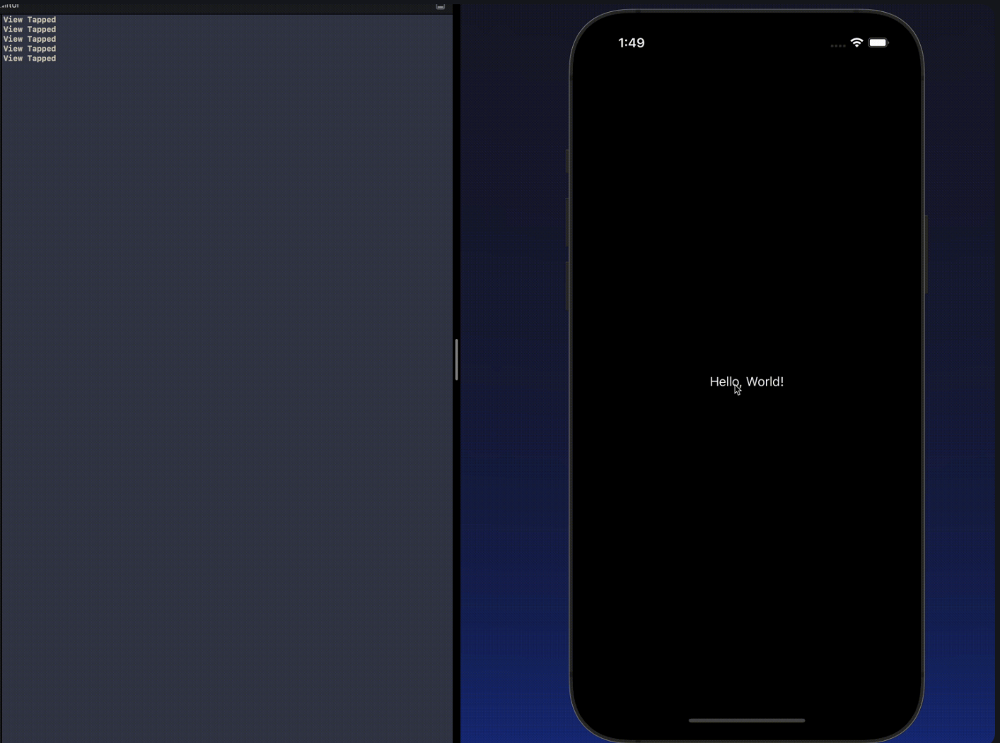

Views can respond to your tap,drags,pinches and other gestures. Just by adding **Gesture** modifer to your View.

## Tap Gestures

This is the most basic type of Gestures. Implementing tap gesture is pretty easy. 
You can call `.onTapGesture()` modifier on the view you want to track gesture on.

```Swift
Text("Hello, World!") // SwiftUI Text view.
            .onTapGesture { // by using this modifier, you can run a specifec action when the View is tapped.
                print("View Tapped") // this function will print "View Tapped" in the console.
            }

```
**Output**:



In the above example, everytime you tap the text view "Hello, World", it prints "View Tapped" in the console.
You can also implement action on a certain amount of tap gesture counts.

```Swift
Text("Hello, World!") // SwiftUI Text view.
            .onTapGesture(count: 3) { // by using this modifier, you can run a specifec action when the View is tapped 3 times.
                print("View Tapped") // this function will print "View Tapped" in the console.
            }

```

 


## Subsection 2

[Text about subsection 2]

## Subsection n

[Text about subsection n]

## Codebyte Example (if applicable)

We can currently support:

- Python
- JavaScript
- Ruby
- C++
- C#
- Go
- PHP

See [content-standards.md](https://github.com/Codecademy/docs/blob/main/documentation/content-standards.md) for more details!

```codebyte/js
# Example runnable code block.
console.log('Hello, World!');
```
